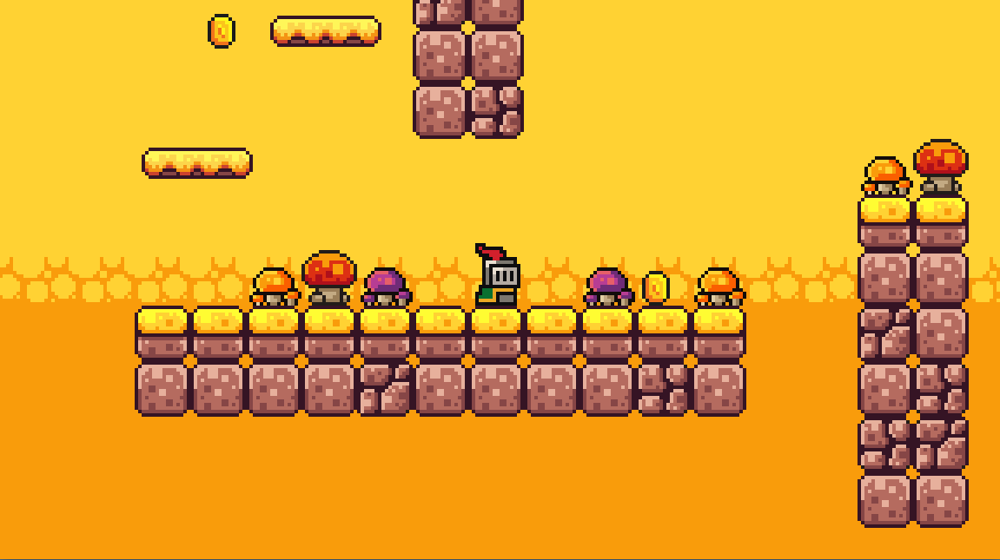

# Example Platformer
A simple 2D platformer made in Godot while I'm learning the engine.
## Preview

## Status
Learning project based on a tutorial. Not a finished game (yet).
Main goals:
- Moving and jumping
- Basic enemy
- Collectable coins
## How to Play
- Move: A / D or Arrow Keys
- Jump: Space
- Goal: Reach the end of the level without dying.
## Running the Project
1. Install Godot [version 4.5.1].
2. Clone this repo.
3. Open the `project.godot` file in Godot.
4. Press `F5` to run.

Tested with Godot 4.5.1
## Project Structure
- `scenes/`        Main scenes (Player.tscn, Level.tscn, etc.)
- `scripts/`       GDScript files (Player.gd, Enemy.gd, etc.)
- `assets/`        Sprites / tilesets / sounds
- `docs/`          Screenshots, notes
## Credits
**Tutorial:**
Based on Brackeys' Godot 2D platformer tutorial on YouTube:
https://www.youtube.com/watch?v=LOhfqjmasi0

**Assets (art/audio/etc.):** 
All visual/audio assets are from the Brackeys Platformer Bundle: 
https://brackeysgames.itch.io/brackeys-platformer-bundle 
See that bundle's license/terms for usage details.
